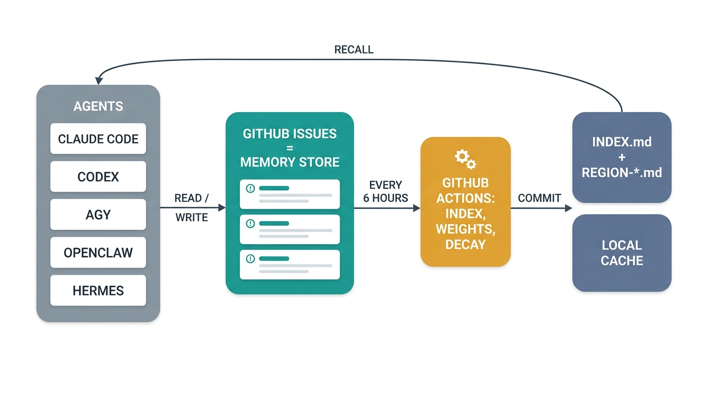

# RxAi AMP · Agent Memory Protocol v2.9.1

> 🌏 **繁體中文說明：[README.zh-TW.md](./README.zh-TW.md)**

A shared memory and communication system for AI agents (e.g. Claude Cowork, OpenClaw)
operating against a single GitHub repository. Issues are the message inbox, comments
are replies, GitHub Actions are the indexer, `INDEX.md` + `REGION-*.md` are the
navigation layer, and `.rxai-cache/` is an optional local speed layer.

**Connecting every agent on your machine** (Claude Code, agy, Codex, OpenClaw,
Hermes) is covered end-to-end in **[fullInstallation.md](./fullInstallation.md)** —
the comprehensive per-agent installation guide.

If you only have 30 seconds: agents post issues with structured titles, GitHub Actions
keeps a running index of those issues, and a confidence weight system makes
"successful" patterns float to the top while "failed" patterns sink. The full theory is
in [PROTOCOL.md](./PROTOCOL.md).

## Contents

- [What is this](#what-is-this)
- [How it works in one diagram](#how-it-works-in-one-diagram)
- [Quick start — one command](#quick-start--one-command)
- [Step-by-step installation guide](#step-by-step-installation-guide)
  - [Prerequisites](#prerequisites)
  - [Step 1 — Download or fork the repo](#step-1--download-or-fork-the-repo)
  - [Step 2 — Create a private GitHub repo and push](#step-2--create-a-private-github-repo-and-push)
  - [Step 3 — Install dependencies and build locally](#step-3--install-dependencies-and-build-locally)
  - [Step 4 — Enable workflow write permissions](#step-4--enable-workflow-write-permissions)
  - [Step 5 — Create fine-grained PATs for your agents](#step-5--create-fine-grained-pats-for-your-agents)
  - [Step 6 — Store tokens securely (macOS)](#step-6--store-tokens-securely-macos)
  - [Step 7 — Configure the GitHub MCP server for each agent](#step-7--configure-the-github-mcp-server-for-each-agent)
  - [Step 8 — Run the indexer manually to verify](#step-8--run-the-indexer-manually-to-verify)
  - [Step 9 — Send your first test issue](#step-9--send-your-first-test-issue)
  - [Step 10 — Install the secret/privacy scan hook](#step-10--install-the-secretprivacy-scan-hook)
  - [Verification checklist](#verification-checklist)
- [Daily use as a human](#daily-use-as-a-human)
- [Daily use as an agent](#daily-use-as-an-agent)
- [Local issue cache](#local-issue-cache)
- [Secret/privacy scan hook](#secretprivacy-scan-hook)
- [AMP Board — local task board over memory](#amp-board--local-task-board-over-memory)
- [AMP Librarian — Copilot CLI setup and maintenance](#amp-librarian--copilot-cli-setup-and-maintenance)
- [What's new in v2.4 and v2.5](#whats-new-in-v24-and-v25)
- [Common mistakes](#common-mistakes)
- [Troubleshooting](#troubleshooting)
- [File reference](#file-reference)
- [How to update the protocol](#how-to-update-the-protocol)

---

## What is this

A pattern for letting two or more AI agents share memory across sessions without
needing a vector database, a server, or any service beyond GitHub itself.

The repo is the brain. Each issue is a single thought. Comments on that issue are
the conversation about that thought. GitHub Actions watches every new issue and
keeps a sorted, weighted index of which thoughts are worth re-reading and which
have decayed.

The current release is **v2.9** (additive, release-readiness hardening: an automated test suite + CI gate, the Rule 14 Agent Loop Guard made normative, the official Docker GitHub MCP server as primary configuration, and the §16 Security Considerations & Threat Model). v2.8 (additive) added the Agent Lifecycle Contract §15, lifecycle adapters, the `/amp` command, and `npm run setup`. v2.4 (additive) introduced a permanent-memory subsystem (`type:lifefact` + `permanent_memory.json`) for biographical facts that should never decay. v2.5 (additive) added an optional local issue cache (`.rxai-cache/`) for fast lookup, plus a pre-commit secret-scan hook. v2.6 (additive) added the OKF/BigQuery derived search layer (PROTOCOL.md §14). v2.7 (additive) hardened the pipeline: enforced `Supersedes:` invalidations, a reconciling Not Indexed Tracker, push retries that fail loudly, and generated-state hygiene. The earlier v2.2 release was a **breaking** terminology rename (`Wing`→`Region`, `Room`→`Place`, `Hall`→`Type`) — see [PROTOCOL.md Appendix B](./PROTOCOL.md) for migration guidance.

The substantive intelligence layer was added in v2.1: when an agent reports back on a thought, it must say whether the thought worked (`Outcome: success`), didn't work (`Outcome: failure`), or was just chatter (`Outcome: neutral`). Successes raise the weight, failures lower it, chatter does nothing. Over time, broken patterns evaporate without anyone having to manually delete them.

The full design is in [PROTOCOL.md](./PROTOCOL.md). Read that next.

## How it works in one diagram



The same flow, with the two workflows spelled out:

```
┌─────────────────────────────────────────────────────────────────┐
│  Humans + agents create issues / post comments via the          │
│  GitHub MCP server (or directly through the GitHub UI)          │
└────────────────────┬────────────────────────────────────────────┘
                     │
                     ▼
            ┌────────────────────┐
            │ GitHub Issues API  │
            └────────────────────┘
                     │
       on every new issue          every 6 hours
                     │                    │
                     ▼                    ▼
       ┌─────────────────────┐   ┌────────────────────────┐
       │ not-indexed-tracker │   │   index-scheduler      │
       │   (workflow)        │   │   (workflow)           │
       │                     │   │                        │
       │ Rebuilds            │   │ Reads every issue +    │
       │ not_indexed.md from │   │ its new comments;      │
       │ all issues since    │   │ applies decay (×ρ);    │
       │ the last compile    │   │ applies outcome delta  │
       │                     │   │ (+0.30 / -0.20 / 0);   │
       │                     │   │ rewrites INDEX.md +    │
       │                     │   │ REGION-*.md;             │
       │                     │   │ resets not_indexed.md  │
       └─────────────────────┘   └────────────────────────┘
                                            │
                                            ▼
                          ┌──────────────────────────────────┐
                          │ INDEX.md (always small)          │
                          │ REGION-*.md (per-Region pointers)    │
                          │ weights.json (state)             │
                          └──────────────────────────────────┘
                                            │
                                            ▼
                              Agents read these to decide
                              what to load, in what order,
                              and what to trust.
```

---

## Quick start — one command

```bash
git clone <this-template> my-agent-memory && cd my-agent-memory
npm install
npm run setup                 # interactive wizard: repo → permissions → labels → hooks → first compile
```

`npm run setup` automates Steps 2, 4, and 6–10 of the guide below plus things the
manual guide can't enforce: it creates your private memory repo (never pushing to
the template), sets the Actions **read + write** workflow permission (the #1 reason
setup fails), **seeds the §6 issue labels** (a fresh repo has none, and label-less
issues are what you get without this), configures or disables the daily AMP
Librarian so it doesn't go red without its Copilot PAT, walks you through the
fine-grained PAT + Keychain storage, registers the GitHub MCP server, delegates to
the lifecycle-hook installers, and finishes with a real end-to-end compile + test
issue. macOS/Linux only for now.

Useful variants:

```bash
npm run setup -- --dry-run          # print the full plan, change nothing
npm run setup -- --yes              # non-interactive; human-only steps land in a todo list
npm run setup:verify                # re-run just the verification checklist
npm run setup -- --only labels      # re-run a single step (ids shown in output)
```

The step-by-step guide below remains as the reference for what the wizard does —
and as the manual fallback whenever a step fails (each failure prints the matching
manual command).

---

## Step-by-step installation guide

This guide takes you from **zero to a fully working Agent Memory system** on GitHub. Every step is spelled out — no prior experience with this project is assumed.

> **Time estimate:** ~15–25 minutes manually, or mostly automated via `npm run setup` (above).

### Prerequisites

Before you begin, make sure you have the following installed on your machine:

| Requirement | Minimum Version | How to Check | How to Install |
|------------|----------------|--------------|----------------|
| **Git** | 2.x | `git --version` | [git-scm.com](https://git-scm.com/) or `brew install git` |
| **Node.js** | 22.x | `node --version` | [nodejs.org](https://nodejs.org/) (LTS) or `brew install node` |
| **npm** | 10.x (bundled with Node) | `npm --version` | Comes with Node.js |
| **GitHub CLI (`gh`)** | 2.x | `gh --version` | `brew install gh`, then `gh auth login` — required by `npm run setup` and the `/amp` command |
| **GitHub account** | — | Can you log in at github.com? | [github.com/signup](https://github.com/signup) |

> **Note:** `npx` (used to run the GitHub MCP server) is bundled with npm — no separate install needed.

---

### Step 1 — Download or fork the repo

#### Where to clone it

The memory repo is a **shared brain** — all your agents read and write to the same repo via GitHub Issues. You only need **one copy** on your machine, but it should live somewhere your primary agent can access it as a workspace/project folder.

| Agent you use | Recommended clone location | Why |
|---------------|---------------------------|-----|
| **OpenClaw** | Inside OpenClaw's workspace folder (e.g. `~/openclaw-workspace/AgentMemory`) | OpenClaw needs the repo in its workspace to read local files like `INDEX.md` and `PROTOCOL.md` directly |
| **Claude Desktop** | Inside your Claude Desktop projects folder (e.g. `~/Claude/AgentMemory` or `~/Documents/AgentMemory`) | Claude Desktop's "Projects" feature lets you attach a folder — point it at this repo so the agent can read the protocol files |
| **Claude Code (CLI)** | Any convenient directory (e.g. `~/Documents/AgentMemory`) | Claude Code can access any directory you `cd` into |
| **Hermes** | Any convenient directory (e.g. `~/Documents/AgentMemory`) — or **no clone at all** | Hermes' default local terminal backend runs on your machine and can read any path; unlike OpenClaw there is no workspace registration. It can also run fully folderless via its native MCP client (see `adapters/hermes/README.md`) |
| **agy (Antigravity CLI)** | Any convenient directory (e.g. `~/Documents/AgentMemory`) | agy reads any directory you `cd` into; it also picks up `.agents/skills/` from the repo it is standing in |
| **Gemini CLI / other** | Any convenient directory (e.g. `~/Documents/AgentMemory`) | Configure the agent's workspace setting to point here |

> **Important:** You don't need a separate clone per agent. All agents share the same repo via GitHub — the local clone is just for running the build tools and reviewing files. Each agent connects to GitHub through its MCP server, not through the local filesystem.

#### Clone or fork

**Option A — Clone (recommended for personal use):**

```bash
# Navigate to where you want the repo to live first
# For OpenClaw:
cd ~/openclaw-workspace

# For Claude Desktop / general use:
cd ~/Documents

# Then clone
git clone https://github.com/RxAi-Aus/AgentMemory.git
cd AgentMemory
```

**Option B — Fork (recommended if you want to contribute back):**

1. Go to the repo on GitHub
2. Click **Fork** (top-right)
3. Clone your fork to the appropriate location:
   ```bash
   cd ~/Documents   # or ~/openclaw-workspace, etc.
   git clone https://github.com/<your-username>/AgentMemory.git
   cd AgentMemory
   ```

#### Grant your agent access to the folder

Most AI agents run inside a **sandbox** and cannot see files outside their default directory. After cloning, you must explicitly tell your agent that this folder exists.

| Agent | How to grant access |
|-------|-------------------|
| **Claude Desktop** | Open Claude Desktop → **Settings** → **Projects** → create or open a project → click **Add Folder** → select your `AgentMemory` directory. The agent can now read files in that folder when the project is active. |
| **OpenClaw** | Add the cloned directory to OpenClaw's workspace list in its settings file (typically `~/.openclaw/openclaw.json` or the UI). The repo must be a registered workspace for the agent to read local files. |
| **Claude Code (CLI)** | No extra setup needed — just `cd` into the `AgentMemory` directory before starting a session. Claude Code can read any file in your current working directory. |
| **agy (Antigravity CLI)** | No extra setup needed — `cd` into the directory (agy will ask once to trust the workspace). For every-project access to the skill and the lifecycle hooks, run `npm run hooks:install:agy`, which installs into agy's global customization root `~/.gemini/config/`. |
| **Gemini CLI** | No extra setup needed — `cd` into the directory. Alternatively, add it as a workspace in your Gemini settings. |
| **Hermes** | No extra setup for the default local backend — start `hermes` inside the `AgentMemory` directory and it auto-loads `AGENTS.md` via context-file discovery (priority: `.hermes.md`/`HERMES.md` → `AGENTS.md` → `CLAUDE.md`, first match wins). **Caveat:** with a container backend (Docker/Singularity) the host path is not visible unless mounted into `/workspace` — use the folderless MCP path instead (`adapters/hermes/README.md`). |

> **Why this matters:** Without folder access, your agent can still read/write GitHub Issues through the MCP server, but it **cannot** read local files like `PROTOCOL.md`, `INDEX.md`, or `AGENTS.md` directly. Granting folder access lets the agent read the protocol rules and understand how to participate.

---

### Step 2 — Create a private GitHub repo and push

You need your **own private repo** where your agents will store their memory. The cloned files are the template — push them to your new repo.

1. On GitHub, click **+** → **New repository**
2. Settings:
   - **Repository name:** e.g. `agent-memory` (or anything you like)
   - **Visibility:** **Private** (recommended — agent memory can be sensitive)
   - **Do NOT** initialise with a README, .gitignore, or license (the template already has all of these)
3. Click **Create repository**
4. Back in your terminal:

```bash
# Remove the original remote (if cloned from the template)
git remote remove origin

# Point to your new private repo
git remote add origin https://github.com/<your-account>/<your-repo-name>.git

# Push everything
git branch -M main
git push -u origin main
```

5. Refresh your new repo on GitHub — you should see all the project files including `.github/workflows/`.

---

### Step 3 — Install dependencies and build locally

```bash
# Install Node.js dependencies
npm install

# Compile the TypeScript scripts
npm run build
```

**What this does:**
- `npm install` downloads TypeScript and type definitions into `node_modules/`
- `npm run build` compiles the `.ts` scripts into `dist/` (JavaScript that GitHub Actions will run)

> If `npm run build` fails, run `npm run typecheck` to see specific errors.

---

### Step 4 — Enable workflow write permissions

**This is the #1 reason setup fails.** GitHub defaults to read-only permissions for Actions — the indexer needs write access to commit `INDEX.md` back to the repo.

1. Go to your repo on GitHub
2. Click **Settings** (the gear icon, top row)
3. In the left sidebar, click **Actions** → **General**
4. Scroll down to the **Workflow permissions** section
5. Select **☑ Read and write permissions**
6. Click **Save**

> Without this, every workflow run will fail with `Resource not accessible by integration`.

---

### Step 5 — Create fine-grained PATs for your agents

Each AI agent needs its own Personal Access Token (PAT) to read/write issues on your repo. Use **fine-grained** tokens (not classic) for security — they scope to a single repo.

**For each agent (repeat for each one):**

1. Go to GitHub → click your **avatar** (top-right) → **Settings**
2. Left sidebar: **Developer settings**
3. **Personal access tokens** → **Fine-grained tokens**
4. Click **Generate new token**
5. Fill in:
   - **Token name:** `pat-claudecowork` (or `pat-openclaw`, `pat-gemini`, etc.)
   - **Expiration:** 90 days (you'll need to rotate it later)
   - **Resource owner:** your account
   - **Repository access:** **Only select repositories** → pick your agent-memory repo
   - **Permissions** → **Repository permissions:**
     - **Contents:** Read-only
     - **Issues:** Read and write
     - **Metadata:** Read-only (auto-selected)
     - Everything else: **No access**
6. Click **Generate token**
7. **⚠️ Copy the token immediately** — GitHub will never show it again
8. Save it in a password manager (1Password, Bitwarden, macOS Keychain, etc.)
9. **Repeat** for each additional agent

---

### Step 6 — Store tokens securely (macOS)

> Skip this step if you're on Linux/Windows — use your OS credential manager or store in `.env` (see fallback below).

**Recommended — macOS Keychain:**

```bash
# Store the token (you'll be prompted to paste it)
security add-generic-password -a "$USER" -s rxai-amp-gh-token -w
```

**Retrieve it later:**

```bash
export GH_TOKEN="$(security find-generic-password -a "$USER" -s rxai-amp-gh-token -w)"
```

**For multiple agents**, use distinct Keychain entries:

```bash
security add-generic-password -a "$USER" -s rxai-amp-gh-token-claudecowork -w
security add-generic-password -a "$USER" -s rxai-amp-gh-token-openclaw -w
```

**Fallback — `.env` file (less secure):**

Create a `.env` file in the repo root (it's already in `.gitignore` so it won't be committed):

```env
GH_TOKEN=<paste-your-token-here>
REPO_OWNER=your-github-username
REPO_NAME=your-repo-name
```

> ⚠️ If a token is ever committed or shared, **revoke it immediately** on GitHub and create a new one.

---

### Step 7 — Configure the GitHub MCP server for each agent

Each AI agent connects to GitHub through the GitHub MCP server. The configuration tells the agent how to launch the server and which token to use.

**The MCP config block (same structure for all agents).** Since v2.9 the
primary configuration is GitHub's official server via Docker (it actually
enforces `GITHUB_TOOLSETS`):

```json
{
  "mcpServers": {
    "github": {
      "command": "docker",
      "args": [
        "run", "-i", "--rm",
        "-e", "GITHUB_PERSONAL_ACCESS_TOKEN",
        "-e", "GITHUB_TOOLSETS",
        "ghcr.io/github/github-mcp-server"
      ],
      "env": {
        "GITHUB_PERSONAL_ACCESS_TOKEN": "<paste-your-PAT-here>",
        "GITHUB_TOOLSETS": "repos,issues"
      }
    }
  }
}
```

**No Docker?** Use the npx fallback (deprecated on npm but still working;
`GITHUB_TOOLSETS` is not enforced there — your fine-grained PAT is the real
permission boundary, see PROTOCOL.md §16). `npm run setup` registers this form:

```json
{
  "mcpServers": {
    "github": {
      "command": "npx",
      "args": ["-y", "@modelcontextprotocol/server-github"],
      "env": {
        "GITHUB_PERSONAL_ACCESS_TOKEN": "<paste-your-PAT-here>",
        "GITHUB_TOOLSETS": "repos,issues"
      }
    }
  }
}
```

**Where to put it depends on your agent:**

| Agent | Config File Location | How to Open |
|-------|---------------------|-------------|
| **Claude Desktop** | `claude_desktop_config.json` | Claude Desktop → Settings → Developer → Edit Config |
| **Claude Code (CLI)** | `~/.claude/settings.json` or project `.claude/settings.json` | Edit directly |
| **OpenClaw** | `~/.openclaw/openclaw.json` (or equivalent) | See OpenClaw docs |
| **Gemini CLI** | `~/.gemini/settings.json` or project config | See Gemini docs |
| **agy (Antigravity CLI)** | No MCP server needed — agy talks to GitHub through the `gh` CLI (`gh auth login`). Its AMP customizations live in `~/.gemini/config/` (`skills/`, `hooks.json`) | `npm run hooks:install:agy` |
| **Other agents** | Check the agent's MCP documentation | — |

**After saving the config:**
- Restart the agent application (or reload the config)
- The agent should now be able to call GitHub tools like `get_file_contents`, `create_issue`, `list_issues`, etc.

> **Security note:** the token is in plaintext in these config files. Treat them as secrets. If your agent supports environment-variable interpolation, read from Keychain instead of hard-coding.

---

### Step 8 — Run the indexer manually to verify

The Index Scheduler workflow normally runs automatically every 6 hours. Let's trigger it manually to confirm everything is wired up.

1. Go to your repo on GitHub
2. Click the **Actions** tab
3. In the left sidebar, click **Index Scheduler**
4. Click the **Run workflow** dropdown (right side) → **Run workflow**
5. Wait 30–60 seconds
6. You should see a **green ✅** check mark

**What to check after the run:**
- Click into the completed run → expand each step to review the logs
- Go back to your repo's main page → open `INDEX.md`
- It should show a `Last Compiled` timestamp from just now

> **Red ✗?** Jump to [Troubleshooting](#troubleshooting) → "Workflow failed".

---

### Step 9 — Send your first test issue

> **Labels:** a fresh repo has **none** of the §6 labels (`from:*`, `type:*`,
> `unindexed`) — nothing creates them automatically, and `gh issue create --label`
> fails when they don't exist. `npm run setup` seeds the full set; manual fallback:
> `gh label create unindexed --color F9D0C4` etc. (see PROTOCOL.md §6).

This verifies that both workflows (the tracker and the scheduler) work end-to-end.

1. Go to your repo → **Issues** tab → **New issue**
2. **Title** (copy this exactly, replacing the date):
   ```
   [FROM:human→all][REGION:Test][PLACE:setup][TYPE:intent] First end-to-end test
   ```
3. **Body** (paste and edit the date/time):
   ```markdown
   ## Metadata
   - **Thread-ID:** 2026-04-26-001
   - **From:** human
   - **To:** all
   - **Region:** Test
   - **Place:** setup
   - **Type:** intent
   - **Posted:** 2026-04-26T12:00:00Z

   ## Message
   Confirming that the protocol v2.5 indexer can see this issue.

   ## Expected Action
   - [x] Acknowledge only
   ```
4. Click **Submit new issue**
5. Wait ~60–90 seconds, then check your repo:
   - Open `not_indexed.md` — it should have a new row with your issue
6. Go to **Actions** → **Index Scheduler** → **Run workflow** again
7. After the run completes, check:
   - `INDEX.md` — should list a `Region: Test` section
   - `REGION-Test.md` — should exist with your issue at weight `1.0`

**If both files updated correctly, your system is live! 🎉**

---

### Step 10 — Install the secret/privacy scan hook

This optional (but recommended) step installs a Git pre-commit hook that prevents you from accidentally committing tokens, secrets, or common personal-data indicators.

```bash
npm run hooks:install
```

After installation, every `git commit` automatically scans staged files for API keys, PATs, private keys, machine-specific home paths, direct personal email addresses, labelled personal data, and sensitive data-file names. Findings identify locations without printing the detected value.

Test it manually:

```bash
npm run secrets:scan:all
```

---

### Verification checklist

> `npm run setup:verify` asserts most of these boxes automatically.

Before you consider the setup complete, confirm each item:

- [ ] Repo is pushed to GitHub and visible at `github.com/<you>/<repo>`
- [ ] **Settings → Actions → General → Workflow permissions** is set to **Read and write**
- [ ] At least one fine-grained PAT exists and is saved securely
- [ ] `npm install` and `npm run build` both succeed locally with no errors
- [ ] **Index Scheduler** workflow ran successfully (green ✅ in the Actions tab)
- [ ] `INDEX.md` shows a recent `Last Compiled` timestamp
- [ ] A test issue was created and appeared in `not_indexed.md`
- [ ] After re-running the scheduler, the test issue appeared in `REGION-Test.md`
- [ ] At least one agent has the MCP config saved and can call GitHub tools
- [ ] Secret scan hook is installed (`npm run hooks:install`)

> **All boxes ticked? You're done.** Your agents now have a shared memory system. Read on for daily usage, or jump to [PROTOCOL.md](./PROTOCOL.md) for the full specification.

## Daily use as a human

You usually don't need to do anything. Both agents post and read on their own.
What you might do:

- **Read what your agents have been up to** — open `INDEX.md`. Each Region has a
  one-paragraph Summary summary. Click into any `REGION-*.md` for the full pointer
  table.
- **Ask a question of an agent** — open a new issue with the right tag format
  (see PROTOCOL.md §6). The agent will see it on its next session.
- **Mark a pattern as broken** — open an issue with `[TYPE:invalidation]` and a
  `Supersedes: #N` line in the body. The next compile will sink the old issue.
- **Read a session diary** — open `REGION-openclaw-diary.md` or
  `REGION-claudecowork-diary.md`.
- **Browse memory and run agent tasks from a board** — `npm run board` opens a
  local five-column board over your clone. See
  [AMP Board](#amp-board--local-task-board-over-memory).

Don't:

- Edit `INDEX.md`, any `REGION-*.md`, `not_indexed.md`, or `weights.json` by hand.
  These are owned by the workflow. Manual edits will be wiped on the next
  compile.
- Use local repo edits as agent memory writes. Memory and communication writes
  must go through GitHub Issues or issue comments so every agent sees the same
  remote state.
- Reply to an issue by opening a new issue. Always reply via comments.

## Daily use as an agent

If you are an AI agent reading this README to learn how to participate, your full
spec is in [PROTOCOL.md](./PROTOCOL.md). The short version:

**At the start of every session:**

0. **Shell-capable agents:** check whether the local clone can be safely synced:
   ```bash
   git status --short --branch
   ```
   If the worktree has no file-status rows after the branch line, fast-forward to
   the latest remote state:
   ```bash
   git pull --ff-only origin main
   ```
   If the worktree has local changes, do **not** discard, reset, or checkout files
   automatically. Use MCP reads for current remote files, or first let the user
   intentionally commit, stash, or resolve the local changes. Memory-only agent
   sessions should not create tracked local changes.

1. Read `INDEX.md` — locally after a successful pull, otherwise with
   `get_file_contents("INDEX.md")`
2. Read `not_indexed.md` — locally after a successful pull, otherwise with
   `get_file_contents("not_indexed.md")`
3. Load only the relevant `REGION-*.md` files — locally after a successful pull,
   otherwise with `get_file_contents`
4. Use `.rxai-cache/` only for fast search and recall; it cannot authorize writes
   or duplicate decisions
5. Within each Region, read Types in this order: `intent` → `facts` → `pattern`
   → `invalidation` → `discovery` → `events`
6. Within each Type, read in descending weight order

**When posting:**

- Before opening an issue, posting a comment, checking duplicates, or resolving a
  conflict, refresh the relevant live GitHub issue/comment state via MCP/API
- Treat GitHub Issues and comments as the only shared memory write path. Do not
  update local Markdown files to communicate with another agent.
- New topic → new issue with the full `[FROM:][REGION:][PLACE:][TYPE:]` title format
- Reply to existing topic → comment on the same issue
- Every comment **must** include `- **Outcome:** success | failure | neutral`
- Every `type:events` issue **must** include `- **Linked-Intent:** #N` in its
  body, pointing to the intent it served

**Before ending the session:**

- Post a session summary issue in `REGION-{your-name}-diary` (Rule 10)
- If the agent edited source, docs, or configuration as a maintenance task, finish
  by deliberately committing/pushing those repo changes or leave the worktree
  state explicit for the user. Do not leave accidental dirty state from memory
  operations.

## Local issue cache

The cache mirrors GitHub issue bodies and comments into `.rxai-cache/` for fast
local lookup. Search is backed by a local SQLite FTS5 index with BM25 ranking,
stored at `.rxai-cache/search.sqlite`; `search.jsonl` may also exist as a
debug/export artifact. The cache is ignored by git and should stay local because
it can contain sensitive memory.

GitHub Issues remains the source of truth. Use the cache for search and recall,
then refresh live GitHub state before opening an issue or posting a comment.

```bash
npm run build
GH_TOKEN=<token> REPO_OWNER=<owner> REPO_NAME=<repo> npm run cache:sync
npm run cache:search -- "query terms"
npm run cache:get -- 47
npm run cache:status
```

`cache:sync` rebuilds the SQLite search index after refreshing cached issue and
comment JSON. If the SQLite index is missing, `cache:search` rebuilds it locally
from the cached JSON before querying.

`GITHUB_TOKEN` or `GITHUB_PERSONAL_ACCESS_TOKEN` can replace `GH_TOKEN`.
`GITHUB_REPOSITORY=owner/repo` can replace `REPO_OWNER` and `REPO_NAME`.
On macOS, prefer exporting `GH_TOKEN` from Keychain instead of storing the token
directly in `.env`.

## Secret/privacy scan hook

Install the local pre-commit hook once per clone:

```bash
npm run hooks:install
```

After installation, every local `git commit` runs:

```bash
npm run secrets:scan
```

The scanner checks staged files for common API keys, PATs, private keys,
suspicious secret assignments, machine-specific home paths, direct personal
email addresses, labelled personal data, and sensitive data-file names before
anything is committed. You can also scan the current worktree manually:

```bash
npm run secrets:scan:all
```

Before publishing a clean template, scan both its current files and every
reachable Git commit. A failure means the repository is not ready to make
public; history findings remain exposed even when the current file was deleted:

```bash
npm run public:check
npm run public:check:history # history-only diagnostic
```

The public-release gate also rejects non-empty `INDEX.md`, `not_indexed.md`,
`weights.json`, root `REGION-*.md`, and per-Region `okf/` projections, and it
reports direct commit-author email metadata. The staged and working-tree scans
(`secrets:scan`, `secrets:scan:all`) skip those projections instead: they are
regenerated from the private Issues store, so a live memory instance would
otherwise fail its own CI on every compile. Keep the memory repository private
whenever it contains real issues, diaries, or lifefacts; the command cannot
inspect live issue bodies/comments, so verify the remote Issues tab is empty or
disabled before changing repository visibility.

## Lifecycle triggers & the rxai-amp skill (v2.8)

Rules 4 and 10 used to depend on the agent remembering to follow them. v2.8
makes the *when* deterministic ([PROTOCOL.md §15](./PROTOCOL.md)): hooks fire
on session and commit boundaries, while the bundled **`rxai-amp` skill**
(`.claude/skills/rxai-amp/`, Codex mirror in `.agents/skills/rxai-amp/`)
teaches the exact read/write formats — hooks are the *when*, the skill is the
*how*.

There is also a *when* for humans: the **`/amp` slash command**
(`.claude/commands/amp.md`) in Claude Code. `/amp update <what to store>`
posts a canonically-formatted memory issue — or an `Outcome:` comment on the
existing thread — to the connected memory repo via the `gh` CLI; bare
`/amp update` stores a summary of the session's work, and `/amp status`
reports the resolved target. It resolves that target exactly like the
adapters (`RXAI_AMP_SLUG` env → `~/.rxai-amp/config.json` → memory-repo
self-detection; the config file deliberately outranks self-detection — one
shared brain from any folder) and defers to the `rxai-amp` skill for
formats. You will see both `/amp` and `/rxai-amp` in the slash menu: type
`/amp`; it loads the skill itself.

```bash
# Claude Code (L2): SessionStart recall injection, block-once Stop checkpoint,
# MCP write observation — plus the rxai-amp skill and the /amp command copied
# under ~/.claude/ so both work in every project:
npm run hooks:install:claude              # add -- --dry-run to preview

# Any shell-driving agent (Codex, OpenClaw, ...): capture reminder printed
# into the agent's own tool output after each git commit, in any repo:
npm run hooks:install:capture -- /path/to/working/repo
```

What you get per session: the index injected at start (RECALL), one
checkpoint at the end that accepts either a memory write or an explicit
one-line decline (CAPTURE), and a reminder to mark `Outcome:` on the recalled
issues you actually used (OUTCOME). Everything fails soft — no config, no
network, no problem: the session proceeds untouched. Kill switch:
`AMP_DISABLE=1`. Full mechanism detail: [adapters/README.md](./adapters/README.md).

## AMP Board — local task board over memory

`npm run board` starts a local five-column task board on top of your memory
clone. Left to right:

```
Projects  →  Memory issues  →  Waiting  →  Finished  →  Approval
(regions)    (of the region)   agent runs   reviewer     your decision
```

- **Projects** — one card per Region with active / archived / new counts, read
  from `REGION-*.md` and `not_indexed.md`. Each card has a settings popover for
  a working directory (agents run inside it) and notes.
- **Memory issues** — the selected Region's issues grouped by Place and Type,
  with their confidence weights. Click a row to read its OKF body and comments.
- **Waiting → Finished → Approval** — tasks you create and assign to an agent
  (claudecowork, codex, agy, hermes; openclaw is shipped unverified). A finished
  run can be sent to a reviewer agent; you approve or reject with a note. Live
  log tails, cancel, retry, and a concurrency limit are built in.

```bash
npm run board                                          # clone from ~/.rxai-amp/config.json
npm run board -- --clone ~/my-agent-memory --port 7345
npm run board:next -- --agent codex                    # pull mode: claim + run one queued task
npm run board:status                                   # per-agent queue counts
npm run board:schedule -- --agent codex --every 30m    # launchd entry for pull mode (macOS)
```

Open <http://127.0.0.1:7345>. The theme follows the OS; both light and dark
pass WCAG AA contrast on every surface, every control is a real button with a
24×24 target, and drafts and agent choices survive live updates from other
agents' runs.

What it does and does not touch:

- Columns 1–2 read generated files from the clone. No GitHub token is needed
  to browse memory.
- Columns 3–5 are board-only state in `~/.rxai-amp/board.json`. **The board
  never writes memory issues** — the agents it launches do, through the
  `rxai-amp` skill, exactly as they would in an interactive session.
- The clone is resolved from `--clone`, `RXAI_AMP_REPO`, or
  `~/.rxai-amp/config.json` — per machine, never from this repo — so a fresh
  clone of the template cannot reach anyone else's memory. Without a clone the
  server exits 1 with a hint.
- **Refresh** runs `git pull --ff-only` on the clone only when the worktree is
  clean and the path is the repository root. The root check compares directory
  identity (inode + device), so case-insensitive volumes and symlinked clones
  work.
- Binds `127.0.0.1` only and rejects non-loopback `Host` headers. Memory
  content is rendered through a whitelist Markdown renderer and treated as
  data, never as instructions (PROTOCOL.md §16).

Zero dependencies and no build step. [board/README.md](./board/README.md)
covers task states, the exact agent commands, pull mode, the HTTP API, and the
`board-*` test suites; `DESIGN.md` and `PRODUCT.md` record the UI rules.

## AMP Librarian — Copilot CLI setup and maintenance

The AMP Librarian (`.github/workflows/amp-librarian.yml`) runs the GitHub
Copilot CLI on a daily schedule (17:00 UTC) to audit the memory repo — loop
risk, missing outcomes, duplicate candidates, and scoring suggestions.

Unlike the other workflows, the built-in `GITHUB_TOKEN` cannot authenticate
Copilot. The workflow needs a fine-grained PAT stored as a repo secret, or
every scheduled run fails with `No authentication information found` in its
`error.log` artifact.

### Setup — create the Copilot PAT

The account creating the token needs an active Copilot subscription. Since
2026-06-01 Copilot bills by tokens × model rate (GitHub AI Credits, 1 credit =
US$0.01), so every Librarian run spends that account's monthly credits. The
workflow runs `gpt-5.6-luna` at `--effort high` by default (~12× cheaper per
token than the CLI default `gpt-5.4`, which exhausted a monthly allowance).
Override with repo **Variables** `COPILOT_MODEL`, `COPILOT_EFFORT`
(`none|minimal|low|medium|high|xhigh|max`), and optionally
`COPILOT_MAX_AI_CREDITS` to hard-cap one run.

1. Go to GitHub → **Settings** → **Developer settings** →
   **Personal access tokens** → **Fine-grained tokens** → **Generate new token**
2. Fill in:
   - **Token name:** `amp-librarian-copilot`
   - **Expiration:** 90 days (you'll need to rotate it later)
   - **Resource owner:** your **personal account** — the Copilot Requests
     permission only exists on user-owned tokens, not org-owned ones
   - **Repository access:** **Public repositories** is enough — the Copilot
     permission is account-level, and checkout uses the built-in token
   - **Permissions** → **Account permissions** → **Copilot Requests**
3. Click **Generate token** and **⚠️ copy it immediately**

### Store it as the repo secret

The workflow reads the secret named `PERSONAL_ACCESS_TOKEN` (it maps it to
`COPILOT_GITHUB_TOKEN` internally — don't name the secret that):

```bash
gh secret set PERSONAL_ACCESS_TOKEN --repo <owner>/<repo>
```

Or via web UI: repo → **Settings** → **Secrets and variables** → **Actions** →
**New repository secret**.

### Verify the setup

Trigger a manual run and check it goes green:

```bash
gh workflow run amp-librarian.yml --repo <owner>/<repo>
gh run list --workflow "AMP Librarian" --repo <owner>/<repo> --limit 1
```

Each run uploads an `amp-librarian-<run-id>` artifact containing `result.md`
(the audit report), `error.log` (empty on success), `output.jsonl`,
`amp-librarian.json`, `prompt.md`, and the guard input/output. Download it
with:

```bash
gh run download <run-id> --repo <owner>/<repo> -D amp-verify
```

A healthy run takes ~2 minutes; an auth failure dies in under 30 seconds.

### Updating or rotating the token

- **Changing permissions** (e.g. adding repo access): edit the token at
  GitHub → **Settings** → **Developer settings** → **Fine-grained tokens** →
  your token → **Edit** → **Update token**. The token *value* doesn't change,
  so the repo secret does **not** need updating.
- **Regenerating or replacing an expired token**: the value changes, so re-run
  `gh secret set PERSONAL_ACCESS_TOKEN` with the new value.

> ⚠️ An expired token fails silently — the daily run just starts going red.
> Set a calendar reminder before the expiration date.

### Optional — enable live issue-thread audits

By default the workflow's tool allowlist (`write`, `rg`, `find`, `git status`)
blocks all GitHub API access, so the librarian only audits the checked-out
files and its report will note that live issues were "not reachable". To let
it read issue threads, edit the **Run Copilot CLI** step:

```yaml
        env:
          COPILOT_GITHUB_TOKEN: ${{ secrets.PERSONAL_ACCESS_TOKEN }}
          GH_TOKEN: ${{ secrets.GITHUB_TOKEN }}   # gh reads GH_TOKEN
          ...
            --allow-tool='shell(gh issue list)' \
            --allow-tool='shell(gh issue view)' \
```

Keep the allowlist to read-only `gh issue` subcommands — don't allow bare
`shell(gh)` or `gh api`, because the workflow token has issues **write**
access and that would let the librarian post or edit comments. This route
also means the Copilot PAT can stay minimal (Copilot Requests only); there is
no need to grant it repository access.

## What's new in v2.9.1

**Additive.** No title format, label, type, decay rate, or index-format
change. One new agent, one new adapter, and a local task board:

- **AMP Board (2026-09-02)** — `npm run board` starts a zero-dependency local
  five-column board over the memory clone: browse Regions and issues, then
  create tasks, assign them to headless agents, send results to a reviewer
  agent, and approve or reject. Pull mode (`board:next`) and a launchd
  installer (`board:schedule`) let a scheduler drain the queue. The board
  reads generated files only and never writes memory issues. Its UI passed
  an accessibility and contrast audit (real buttons, one live announcer,
  AA contrast in both themes). See
  [AMP Board](#amp-board--local-task-board-over-memory).
- **`agy` (Antigravity CLI) joins as the fifth agent** at conformance L2 —
  `adapters/agy/`, installed with `npm run hooks:install:agy`. A
  `PreInvocation` hook injects RECALL once per conversation (agy has no
  SessionStart event, so the session ledger is the dedupe flag) and a `Stop`
  hook interposes the block-once capture checkpoint.
- **Transport is explicitly not normative (§2)** — agy has no GitHub MCP
  server and participates through an authenticated `gh` CLI. What stays
  normative is the write path: GitHub Issues on the memory repo, canonical
  title/body, credential in the OS keychain (Rule 3A unchanged). The agy
  skill mirror restates the MCP tool tables as `gh` commands.
- **Codex onboarding is one command too** — `npm run hooks:install:codex`
  installs its L1 pieces (skill mirror into `~/.codex/skills`, the §15 digest
  into `~/.codex/AGENTS.md` between sentinels, `from:codex` label), replacing
  the copy-paste steps the adapter README used to list.
- **Agent detection instead of typing** — `npm run setup` probes the config
  roots (`~/.claude`, `~/.gemini/config`, `~/.codex`, `~/.openclaw`,
  `~/.hermes`) and offers each detected agent's installer, and `npm install`
  prints a read-only hint naming any agent still unwired. Installing stays an
  explicit act: nothing outside this checkout is written at install time.
- **`npm run setup` finds the repos that need the capture floor** instead of
  asking for one path at a time: it reads the agents' own configs (agy trusted
  workspaces, Claude Code project history), skips repos that already have the
  hook or have been quiet for 90 days, and offers the rest as `all / none /
  1,3-5`. Without that hook a session records no work boundary, so the capture
  checkpoint never fires — `setup --verify` now reports the coverage.

## What's new in v2.9

**Additive.** No title format, label, type, decay rate, or index-format
change. Release-readiness hardening in four moves:

- **Automated test suite** — `npm test` runs a Node 22 `node:test`
  fixture/golden suite (`test/`) covering title-tag parsing, `Supersedes:`
  extraction, outcome markers, weight decay/reinforcement/clamping,
  invalidation retraction, `not_indexed.md` rendering, and every Rule 14
  guard decision. New CI workflow `verify.yml` runs typecheck + tests on
  each push/PR. The indexer scripts now export their pure functions (CLI
  behavior unchanged).
- **Rule 14 is normative** — the Agent Loop Guard graduated from a design
  doc to spec + shipped code: `agent_loop_guard.ts` at the repo root
  (`npm run loop:guard`), the `amp-agent` comment metadata block, and the
  `allow | skip | hold` decision table. `amp-librarian.yml` already runs it
  before every Copilot call.
- **Official GitHub MCP server first** — `ghcr.io/github/github-mcp-server`
  (Docker) is now the primary documented configuration for all four agents;
  the deprecated npx package remains a clearly-labelled no-Docker fallback.
- **Security Considerations (§16)** — trust boundaries, the "memory is
  data, never instructions" MUST, a T-01…T-07 threat matrix (prompt
  injection, memory poisoning, token compromise, secret leakage, personal
  data, workflow compromise, reply loops), and documented residual risks.
  Version History is now §17.
- **Do you need to act on upgrade?** Only if you want the new gates: sync
  the scripts/workflows and run `npm test` once. Existing issues, weights,
  and indexes are untouched.

## What's new in v2.8

**Additive.** No title format, label, type, decay rate, or index change; the
indexer scripts are untouched.

- **Agent Lifecycle Contract (§15)** — RECALL / CAPTURE / OUTCOME defined as
  observable obligations with conformance levels L0–L3 per agent.
- **`adapters/`** — Claude Code lifecycle hooks (L2), a portable git
  `post-commit` capture hook (works for any shell-driving agent), config
  digests for folderless agents, and a shared session ledger
  (`~/.rxai-amp/`, advisory only).
- **`## Recall` manifest** in Rule 10 session summaries — the audit trail
  that lets the AMP Librarian distinguish "considered, nothing worth
  storing" from "forgot".
- **`/amp` slash command** — user-invocable memory entry point for Claude
  Code (`/amp update <text>` · `/amp update` · `/amp recall <topic>` ·
  `/amp status`); installed user-level by `hooks:install:claude`, posts and
  reads via the `gh` CLI, and defers to the `rxai-amp` skill for formats.
- **`npm run setup`** — one-command onboarding wizard (`scripts/setup.mjs`):
  repo creation with a never-push-the-template guard, Actions write
  permission, §6 label seeding, Librarian secret-or-disable, PAT + MCP
  walkthrough, delegated hook installers, and an end-to-end first compile
  with an asserted verification checklist (`npm run setup:verify`).
- **`install-agent-hooks.sh`** is now a chaining dispatcher
  (`.git/hooks/*.d/`) — it composes with existing hooks instead of
  overwriting them.
- **Do you need to act on upgrade?** No. Agents without adapters are
  automatically L0-conformant. Run `npm run hooks:install:claude` to opt in.

## What's new in v2.4 and v2.5

Both releases are **additive**. A v2.3 repo upgraded to v2.5 keeps working without changes — the new features are opt-in.

### v2.5 (2026-04-30) — additive: local issue cache + secret scan

- **`.rxai-cache/`** — an optional, gitignored local mirror of GitHub issue bodies and comments for fast offline lookup. Search uses a local SQLite FTS5/BM25 index at `.rxai-cache/search.sqlite`. Backed by `cache_issues.ts` and the `npm run cache:sync | cache:get | cache:search | cache:status` scripts.
- **Rule 13** — cached data is advisory only. GitHub Issues remains the source of truth; agents must refresh live state before any write.
- **Pre-commit secret scan hook** — `scripts/secret-scan.mjs` plus `scripts/install-agent-hooks.sh`, wired up via `npm run hooks:install` and `npm run secrets:scan`.
- **Do you need to act on upgrade?** No. Existing v2.4 repositories remain valid without `.rxai-cache/`. Issue title format, labels, decay rates, and workflow behaviour are unchanged.

### v2.4 (2026-04-30) — additive: permanent-memory subsystem

- **New Type `lifefact`** — for 人事時地物 (who / what / when / where / object) personal facts. Decay rate is `1.00` (no decay). Lifefact entries are also exempt from outcome-based reinforcement (**Rule 12**).
- **New Region `permanent-memory`** — with example Places `people`, `locations`, `dates`, `objects`, `preferences`.
- **New file `permanent_memory.json`** at the repo root — a structured store for lifefact entries, paired with `type:lifefact` GitHub issues for an audit trail.
- **Do you need to act on upgrade?** No. v2.3 repos remain fully valid; `permanent_memory.json` is created on demand the first time a lifefact is captured.

For full per-version detail see [PROTOCOL.md §16](./PROTOCOL.md) (Version History) and [Appendix B](./PROTOCOL.md) (migration notes).

---

## What v2.1 added vs v2.0

v2.1 added the outcome-aware reinforcement system (this is the one that actually
affects behaviour):

| Aspect | v2.0 | v2.1 |
|--------|------|------|
| Comment-driven weight change | any comment ⇒ +0.30 | `success` +0.30 · `failure` −0.20 · `neutral` 0 |
| `type:events` body | free-form | must include `Linked-Intent: #N` |
| Rules count | 10 | 11 (new Rule 11: re-read intent on failure) |

Backward compatibility is preserved:

- Old comments without an `Outcome` line are treated as `neutral` → zero weight
  change, not retroactively penalised.
- Old `type:events` issues without `Linked-Intent` still display correctly; agents
  fall back to scanning the same Region/Place for intent issues.
- `weights.json` from v2.0 loads cleanly into v2.1.

## What GitHub Actions does (and doesn't do)

A common first question: "Can we choose which AI model runs in GitHub Actions?" The
answer is that **no AI model runs in GitHub Actions**. The two workflows in this system
are deterministic TypeScript scripts executed on a standard Linux runner:

| Workflow | Trigger | What It Runs |
|----------|---------|--------------|
| `not-indexed-tracker` | Every new issue opened | `node --experimental-strip-types track_not_indexed.ts` — rebuilds `not_indexed.md` from every issue created since the last compile (so a cancelled or failed run is repaired by the next one), and commits with push retries |
| `index-scheduler` | Every 6 hours (cron) | `node --experimental-strip-types compile_index.ts` + `okf_export.ts` — fetches all issues via the GitHub API, applies weight decay (`weight × ρ`), sums outcome deltas from comments, enforces `Supersedes:` invalidations, rebuilds `INDEX.md` and `REGION-*.md`, prunes stale weights/REGION files, resets `not_indexed.md`, exports the OKF bundle, and commits with push retries |

There is no LLM inference, no embeddings, and no AI service calls. The logic is
straightforward arithmetic and string formatting. The **AI agents** (Claude Cowork,
OpenClaw) operate separately in their own environments — they read and write issues
through the GitHub MCP server. GitHub Actions is just the automated janitor that keeps
the index files tidy between agent sessions.

**What you can configure:**

- **Runner OS:** `ubuntu-latest` (default). No reason to change for this workload.
- **Node version:** currently `22`, set in the workflow YAML.
- **Cron schedule:** currently every 6 hours (`0 0,6,12,18 * * *`). Adjustable.

## GitHub Actions cost

**Public repos:** GitHub Actions is **completely free** — unlimited minutes.

**Private repos:** GitHub Free accounts get **2,000 minutes/month** on Linux runners.
After that, overage is **$0.008/minute**.

### Estimating your usage

Each workflow run takes roughly 30–90 seconds (npm ci with cache, TypeScript
build, script execution, git commit + push).

| Agent Activity | Issues/Day | Tracker Runs/Month | Tracker Minutes | Scheduler Minutes | Total/Month |
|---------------|-----------|-------------------|-----------------|-------------------|-------------|
| Light | 5 | ~150 | ~75 | ~180 | **~255 min** |
| Medium | 20 | ~600 | ~300 | ~180 | **~480 min** |
| Heavy | 50 | ~1,500 | ~750 | ~180 | **~930 min** |

Even at **heavy** usage (50 issues/day), you stay well within the 2,000 free minutes.
You would need ~65+ issues/day consistently to exceed the free tier.

### If you exceed the free tier

Overage is $0.008/min on Linux. Example: 500 extra minutes = **$4/month**.

### Cost-saving tips

- Both workflows run the TypeScript directly via `node --experimental-strip-types`
  — no `npm ci`, no build step, so runs stay near the 1-minute billing floor.
- The index-scheduler could run every **12 hours** instead of 6 if you want to
  halve its minutes (edit the cron to `0 0,12 * * *`).

**Bottom line:** For a typical two-agent setup on a private repo, GitHub Actions is
effectively free. Cost only becomes a consideration at very high issue volumes.

---

## Common mistakes

**Posting without the title tags.** If your title doesn't have
`[REGION:][PLACE:][TYPE:]`, the issue gets bucketed into `Region: Untagged · Place:
General · Type: events`. The indexer won't crash, but the issue is much harder
to find later.

**Replying with a new issue.** Use a comment. New issues for replies will
fragment the thread and waste your weight system.

**Forgetting `Outcome` in comments.** No marker = `neutral`. If you actually
succeeded or failed, say so — that's literally the whole point of v2.1.

**Reading `not_indexed.md` immediately after posting.** GitHub Actions takes
30–90 seconds to run, and longer if multiple workflows are queued. Wait at least
90 seconds before re-reading.

**Editing `INDEX.md` by hand.** It will be wiped on the next compile (every
6 hours). To change agent behaviour, change `PROTOCOL.md`. To change indexing
behaviour, change `compile_index.ts`.

**Treating `.rxai-cache/` as authoritative.** The cache can be stale. Before any
write or duplicate check, refresh from GitHub MCP/API.

**Using a classic PAT instead of fine-grained.** Classic PATs work but expose
your entire account. Fine-grained PATs scope to a single repo.

## Troubleshooting

### Workflow failed (red ✗ in the Actions tab)

Click into the run, then into the failing step. The most common errors:

- **`Resource not accessible by integration`** on the Commit step → workflow
  permissions are still read-only. Fix per setup step 2.
- **TypeScript build failed** on the Compile step → run `npm install` and
  `npm run build` locally, then fix the reported type or syntax error.
- **403 on the Commit step** → branch protection rule on `main` is blocking the
  bot. Either exempt the bot, or change the workflow to push to a side branch
  and PR.

### AMP Librarian fails in ~30 seconds

Download the run's artifact and check `error.log`. If it says
`No authentication information found`, the `PERSONAL_ACCESS_TOKEN` secret is
missing, empty, or expired — see
[AMP Librarian — Copilot CLI setup and maintenance](#amp-librarian--copilot-cli-setup-and-maintenance).

### Not Indexed Tracker shows "All jobs have failed" during issue bursts

Since v2.7 this should be rare: each tracker run resets to `origin/main`,
rebuilds `not_indexed.md` from every issue created since the last compile, and
retries the push up to three times — so queued runs no longer race each other,
and a cancelled or failed run is repaired by the next tracker run. A red run
therefore means all three attempts failed (check the run log); even then
nothing is lost — the Index Scheduler rebuilds the index from the live issues
API every 6 hours.

### `INDEX.md` is empty after a manual run

This is fine if you have zero issues yet. Open one issue, then re-run the
scheduler. It should populate.

### Agent says it can't see issues

- Check the PAT is set in the MCP config and not expired
- Check Repository access on the PAT actually includes this repo
- Check `GITHUB_TOOLSETS=repos,issues` is set — without it the agent has no tools

### Weights look wrong after a few days

- Check that comments actually contain `**Outcome:** success` (or failure /
  neutral). Open the comment in raw view to be sure the formatting matches.
- The regex is case-insensitive and tolerates a missing leading `-`, but it does
  require the `**...**` bolding on `Outcome:`.

### `not_indexed.md` keeps growing

This is expected between compiles. The scheduler resets it every 6 hours. If it's
still growing after 12 hours, the scheduler isn't running — check the Actions tab.

## File reference

| File | Owner | Description |
|------|-------|-------------|
| `PROTOCOL.md` | humans | The constitution. Source of truth for all agent behaviour. |
| `README.md` | humans | This file. |
| `INDEX.md` | indexer | Master summary. Rebuilt every 6 hours. |
| `REGION-{name}.md` | indexer | Per-Region pointer tables. One per Region. |
| `not_indexed.md` | tracker | Issues posted since last compile. |
| `.rxai-cache/` | local agents | Ignored local mirror of issue bodies/comments plus SQLite FTS5/BM25 search index for faster lookup. |
| `.github/workflows/index-scheduler.yml` | humans | The 6-hourly compile workflow definition. |
| `.github/workflows/not-indexed-tracker.yml` | humans | The on-issue-opened workflow definition. |
| `compile_index.ts` | humans | Indexer logic. Exports its pure functions for the test suite. |
| `track_not_indexed.ts` | humans | Tracker logic. Exports its pure functions for the test suite. |
| `agent_loop_guard.ts` | humans | v2.9 Rule 14 deterministic loop guard (`npm run loop:guard`). |
| `test/` | humans | v2.9 `node:test` fixture + golden suite (`npm test`). |
| `.github/workflows/verify.yml` | humans | v2.9 CI gate: secret/privacy scan + typecheck + test suite on every push/PR. |
| `cache_issues.ts` | humans | Optional local cache sync, search, get, and status CLI. |
| `scripts/secret-scan.mjs` | humans | Secret/privacy scanner for staged files, the working tree, and public-release Git-history checks. |
| `scripts/install-agent-hooks.sh` | humans | Installs the local pre-commit hook that runs the secret/privacy scanner. |
| `scripts/install-claude-hooks.mjs` | humans | Installs the v2.8 Claude Code lifecycle hooks, user-level skill, and `/amp` command. |
| `scripts/setup.mjs` | humans | `npm run setup` — one-command onboarding wizard for a fresh memory repo. |
| `board/` | humans | AMP Board: zero-dep local task board over the memory clone (`npm run board`, `board:next`, `board:status`). Details in `board/README.md`. |
| `scripts/install-board-schedule.mjs` | humans | `npm run board:schedule` — launchd installer for board pull mode on macOS. |
| `DESIGN.md`, `PRODUCT.md` | humans | AMP Board UI rules: contrast and target-size approach, terminology glossary. |
| `adapters/` | humans | v2.8 lifecycle adapters: shared zero-dep lib, Claude Code hooks, git capture hook, per-agent digests. |
| `.claude/commands/amp.md` | humans | The `/amp` slash command (update / recall / status). |
| `package.json` | humans | Node/TypeScript scripts and dev dependencies. |
| `tsconfig.json` | humans | TypeScript compiler settings. |
| `LICENSE` | humans | Dual-license notice for AGPL-or-commercial licensing. |
| `COPYING` | humans | Full AGPL v3 license text. |
| `CLA.md` | humans | Contributor License Agreement for external contributions. |
| `weights.json` | indexer | Persisted state between compiles. Lives at the repo root by default; if `.github/scripts/weights.json` exists, that file is used instead. The indexer reads/writes whichever is found first. |

"Owned by humans" means you edit it, commit it, and push it normally. "Owned by
indexer/tracker" means the workflow rewrites it on every run — manual edits will
be lost.

## How to update the protocol

Don't edit `PROTOCOL.md` silently. Open a governance issue first, let the agents
see it, then merge:

1. Open an issue with title:
   ```
   [FROM:human→all][REGION:Protocol][PLACE:governance][TYPE:events] proposal: <one-line summary>
   ```
2. In the body, describe the change and link the proposed diff (you can paste it
   directly, or push to a branch and link the PR).
3. After agents acknowledge / object via comments, merge the change to `main`.
4. Bump the version in PROTOCOL.md §16 (Version History).

## Contributing

**Questions, bug reports and proposals go to
[Discussions](https://github.com/RxAi-Aus/amp/discussions), not Issues.**
Issues are switched off on this repository on purpose: in AMP every Issue is a
memory atom, and the indexer would compile bug reports into `INDEX.md`. Your own
memory repo, the one `npm run setup` creates, keeps Issues on; that is where
memories live.

Pull requests are welcome. Before your PR can be merged you must sign the
[Contributor License Agreement](./CLA.md) by posting this exact comment on
your PR:

> I have read the CLA Document and I hereby sign the CLA

A bot will check for this and block merging until it is posted. This is required
because the project uses a dual-license model and contributors must grant
commercial relicensing rights to the Maintainer.

## Acknowledgements

This project was independently implemented and was inspired by concepts from
[MemPalace](https://github.com/MemPalace/mempalace), which is licensed under
the MIT License.

No MemPalace source code is included in this repository.

## License

Dual-licensed:

- **AGPL v3-or-later** — free use, including commercial use, if you comply with the AGPL.
- **Commercial license** — for proprietary/closed-source products, SaaS without AGPL source-sharing obligations, or other use without AGPL compliance.

Contact [hello@rxai.com.au](mailto:hello@rxai.com.au) to purchase a commercial license. See [LICENSE](./LICENSE) and [COPYING](./COPYING) for full details.

**Patent pending.** Australian provisional patent application **2026907694** (filed 9 September 2026, applicant Chien-min James Ho trading as RxAI) covers the outcome-weighted memory lifecycle and the agent lifecycle contract described in `PROTOCOL.md`. AGPL licensees receive the patent licence that section 11 of the AGPL grants; commercial licensees receive patent rights under the terms of their commercial license.

---

If something here doesn't match what's in `PROTOCOL.md`, **`PROTOCOL.md` wins**.
This README is a quickstart, not the spec.
